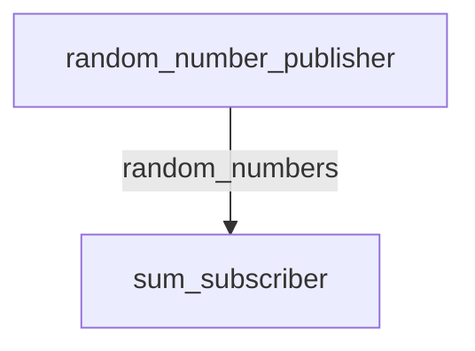

# `bor_fbv` package
ROS 2 C++ package.  [](https://docs.ros.org/en/humble/)

## Description
This package contains two nodes:
- `random_number_publisher`: Publishes two random numbers on the `random_numbers` topic.
- `sum_subscriber`: Subscribes to the `random_numbers` topic, adds the two numbers, and prints the result.

### Mermaid diagram



## Packages and build

It is assumed that the workspace is `~/ros2_ws/`.

### Clone the packages
``` r
cd ~/ros2_ws/src
```
``` r
git clone https://github.com/bmartin024/bor_fbv
```

### Build ROS 2 packages
``` r
cd ~/ros2_ws
```
``` r
colcon build --packages-select bor_fbv --symlink-install
```

<details>
<summary> Don't forget to source before ROS commands.</summary>

``` bash
source ~/ros2_ws/install/setup.bash
```
</details>

``` r
ros2 launch bor_fbv random_sum_launch.py
```

Now `colcon build` your ROS 2 package and you can start wokring.